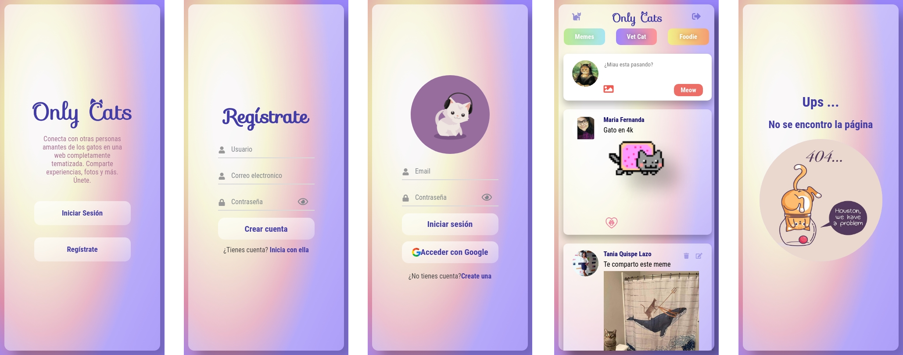

# Only Cats

## Índice

* [1. Preámbulo](#1-preámbulo)
* [2. Resumen del proyecto](#2-resumen-del-proyecto)
* [3. Historias de usuario](#4-historia-de-usurio)
* [4. Pagina web](#5-pagina-web)

## 1. Preámbulo

Instagram, Snapchat, Twitter, Facebook, Twitch, Linkedin, etc. Las redes
sociales han invadido nuestras vidas. Las amamos u odiamos, y muchos no podemos
vivir sin ellas.

Hay redes sociales de todo tipo y para todo tipo de intereses. Por ejemplo,
en una ronda de financiamiento con inversionistas, se presentó una red social
para químicos en la que los usuarios podían publicar artículos sobre sus
investigaciones, comentar en los artículos de sus colegas, y filtrar artículos
de acuerdo a determinadas etiquetas o su popularidad, lo más reciente, o lo
más comentado.

## 2. Resumen del proyecto
OnlyCats es una red social creada para interacturar y compartir contenido con usuarios amantes de los gatos. Te permite crear una cuenta de acceso y loguearse con ella; crear, editar, borrar y _"likear"_ publicaciones. Implementada en lenguaje Javascript utilizando CSS, HTML y Firebase para el almacenamiento de datos.
## 3. Historias de usuario
### 3.1 Definición del producto
Los principales usuarios del producto son personas mayores de 16 años amantes de los gatos que interactuan constantemente en redes sociales. Esta red es útil para encontrar memes y anécdotas en un solo lugar.

### 3.2 Historias de usuario
Cada una de las Historias de usuario contiene:
* **Criterios de Aceptación:** Todo lo que debe ocurrir para satisfacer las
  necesidades del usuario.

* **Definición de terminado:** Todos los aspectos técnicos que cumplen. **Todas** las historias de Usuario (salvo excepciones),incluyen estos aspectos en su definición de terminado:
  - Son SPA.
  - Son _responsive_.
  - Han recibido _code review_ de al menos una compañera de otro equipo.
  - Contienen _test_ unitarios
  - Se testearon manualmente buscando errores e imperfecciones simples.
  - Se hicieron _pruebas_ de usabilidad e incorporaron el _feedback_ de los
    usuarios como mejoras.
  - Se desplegaron en aplicación.

### 3.3 Diseño de la Interfaz de Usuario (prototipo de baja fidelidad)

El prototipo de baja fidelidad definira el flujo que seguirá el usuario dentro de la web y, con eso, se diseño la Interfaz de Usuario:

* **Vista mobile:**

* **Vista dekstop:**

### 3.4 Prototipo de alta fidelidad

Siguiendo el flujo del prototipo de baja fidelidad, se realizo el prototipo de alta fidelidad en Figma. Definiendo la paleta de colores y diseño.

* **Vista mobile:**

    

* **Vista dekstop:**

    

## 4. Página web (responsive)
Se puede ver en dispositivos de pantallas grandes (computadoras/es, laptops, etc.) y pequeñas (_tablets_, celulares, etc.). Se implementaron con la técnica de _`mobile first`_ .

* **Vista mobile:**

    
    

* **Vista dekstop:**

    

* **Vista dekstop:**

    
    
